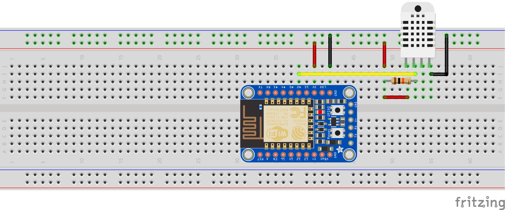

# MSFHAC_Smartmeter

This is a rework project of the FH Aachen Makerspace Smartmeter project.
Its a simple mqtt based dht22 sensor node with an lasercut case for students.

The sensor uses a esp8266 or esp32 development board with an DHT22 sensor.

This repositoy contains a rewritten version of the original software, to make the project compatible with:

* ESP8266 and ESP32 Support
* easy wifi configuration
* mqtt2influx db converter script
* influx db 2.0 support


## BUILD INSTRUCTIONS

### SENSOR NODE



#### SOFTWARE

Flash the esp8266 or esp32 using the Arduino IDE.
Copy the `/src/smartmeter/required_libs`-folder into the `Arduino/libraries`-folder.
Open the `smartmeter.ino` file and select the right board under the tools tab.
If your board isnt present in the list, you may need to include the boards file.
To perform this task copy the following urls and insert these in the Arduino-IDE setting -> Additional Boards:

* `https://raw.githubusercontent.com/espressif/arduino-esp32/gh-pages/package_esp32_dev_index.json`
* `http://arduino.esp8266.com/stable/package_esp8266com_index.json`

Click upload, to compile and flash the program.


After resetting the node, scan the wifi for open netzworks and select  `SMARTMETER ConfigurationxxXXXxXX`, to set the wifi setting for your network.
If the webpage didnt open automatically, simply enter the following ip in your browser:

* `http://192.168.4.1/`


After this step and an additional reset the node should be visiable in your network.
Open the ip adress of the node to configure you mqtt server and topic.


### INFLUXDB INSTALLATION

```bash
# INSTALL MQTT SERVER
sudo apt update
sudo apt upgrade -y
sudo apt install -y mosquitto mosquitto-clients
sudo systemctl enable mosquitto.service
sudo systemctl start mosquitto.service

# INSTALL INFLUX
wget -qO- https://repos.influxdata.com/influxdb.key | gpg --dearmor | sudo tee /etc/apt/trusted.gpg.d/influxdb.gpg > /dev/null
export DISTRIB_ID=$(lsb_release -si); export DISTRIB_CODENAME=$(lsb_release -sc)
echo "deb [signed-by=/etc/apt/trusted.gpg.d/influxdb.gpg] https://repos.influxdata.com/${DISTRIB_ID,,} ${DISTRIB_CODENAME} stable" | sudo tee /etc/apt/sources.list.d/influxdb.list > /dev/null

sudo apt-get update && sudo apt-get install influxdb2


sudo service influxdb enable
sudo service influxdb start
sudo service influxdb status


# SETUP DATABASE USERS
# UES FOR ORGANISATION AND BUCKIET IOT
influx setup
influx auth list
# AFTER THIS SETUP YOU CAN LOGIN USING 127.0.0.1:8086 TO ACCESS THE WEB CONFIG

```


### MQTT2INFLUX BRIDGE

This bridge scrip simply subscribes to all topics inside a given namespace `/iot` and writes all messages with float values in it into the `iot` bucket f the influx db instance.
So you dont need to modify the scrip if you want to add more sensors.


```bash
# INSTALL PYTHON PACKAGES
sudo apt install python3-pip -y
sudo pip3 -H install paho-mqtt python-etcd
python3 -m pip install influxdb


# CLONE REPO
cd /home/pi
git clone git@github.com:RBEGamer/MSFHAC_Smartmeter.git ./MSFHAC_Smartmeter

# MODIFY SCRIPT:
nano /home/pi/MSFHAC_Smartmeter/src/mqtt2influx/bridge/mqtt_iot_influx_bridge.py

# 11 | INFLUXDB_ADDRESS = 'http://127.0.0.1:8086'
# 12 | INFLUXDB_ORG = 'iot'
# 13 | INFLUXDB_TOKEN = '<FROM_INFLUX_DB_WEBUI>'
# 14 | INFLUXDB_BUCKET = 'iot'
# 18 |  MQTT_PORT = 1883
# 19 | MQTT_ADDRESS = '127.0.0.1'

# MAKE SCRIP EXECUTABLE
chmod +x /home/pi/MSFHAC_Smartmeter/src/mqtt2influx/bridge/mqtt_iot_influx_bridge.py
# $ contab -e INSERT:
@reboot python3 /home/pi/MSFHAC_Smartmeter/src/mqtt2influx/bridge/mqtt_iot_influx_bridge.py
```


